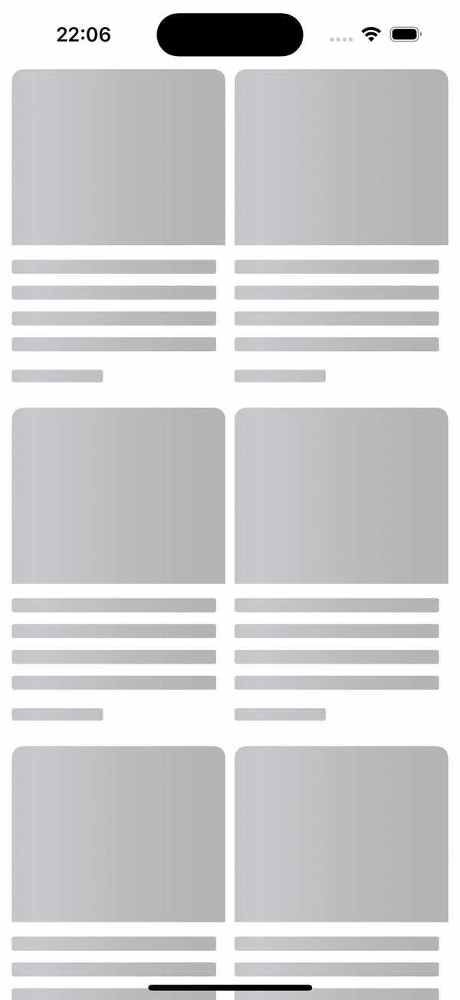
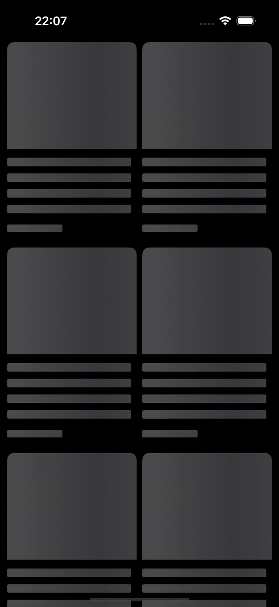

# ReductedShimmer

`ReductedShimmer` is a super-lightweight **SwiftUI** modifier that seamlessly adds a reducted preview with a shimmering effect to any View. It’s perfect for indicating loading states while maintaining a smooth and native SwiftUI experience.

### Why Use ReductedShimmer?<br />
✅ **Built for SwiftUI** – Unlike traditional UIKit solutions, ReductedShimmer leverages SwiftUI’s native architecture, ensuring optimal performance and minimal boilerplate code.<br />
✅ **Light & Efficient** – A minimalistic approach without unnecessary dependencies.<br />
✅ **Seamless Integration** – Works effortlessly with any SwiftUI View. You don’t need to apply the modifier to every individual component—applying it to a higher-level container view is often enough for a consistent and elegant shimmering effect.<br />
✅ **Adaptive by Design** – Supports light & dark mode, left-to-right (LTR) & right-to-left (RTL) layouts, and all Apple platforms: iOS, macOS, tvOS, watchOS, and even visionOS!<br />

A Modern Alternative to UIKit Solutions
Before SwiftUI, UIKit developers commonly relied on libraries like [SkeletonView](https://github.com/Juanpe/SkeletonView) and [Shimmer
](https://github.com/facebookarchive/Shimmer/tree/master) to achieve similar effects. ReductedShimmer is the best native SwiftUI alternative, providing the same functionality but with a declarative, SwiftUI-first approach.


 

## Usage

```swift
import SwiftUI
import ReductedShimmer

Text("SwiftUI ReductedShimmer")
    .modifier(ShimmerModifier())
```
or more conveniently

```swift
Text("SwiftUI ReductedShimmer")
    .shimmer()
```
or more complex

```swift
import SwiftUI
import ReductedShimmer

struct GridViewExample: View {
    // Sample data for the grid
    let items = Array(1...20) // Number of items in the grid

    var body: some View {
        ScrollView {
            LazyVGrid(columns: [GridItem(.adaptive(minimum: 150))], spacing: 10) {
                ForEach(items, id: \.self) { item in
                    GridItemView()
                        .cornerRadius(10)
                        .shimmer(
                            direction: .right,
                            animationAutoreverses: true,
                            gradient: Gradient(colors: [
                                Color.primary,
                                Color.gray,
                                Color.primary,
                                Color.gray,

                            ]))
                }
            }
            .padding(.horizontal, 10)
        }
    }
}

struct GridItemView: View {

    let title = "Lorem ipsum dolor sit amet, consectetur adipiscing elit, sed do eiusmod tempor incididunt ut labore et dolore magna aliqua"
    let date = "25 Jan 1995"

    var body: some View {
        VStack(alignment: .leading, spacing: 8) {
            // Image
            Image(systemName: "message.circle")
                .resizable()
                .frame(minWidth: 100, minHeight: 150, maxHeight: 150)
                .frame(height: 150)

            // Title
            Text(title)
                .font(.headline)
                .lineLimit(4)
                .multilineTextAlignment(.leading)
                .padding(.trailing, 8)

            // Date
            Text(date)
                .font(.subheadline)
                .padding(.bottom, 8)
        }

        .clipShape(RoundedRectangle(cornerRadius: 10))

    }
}

struct GridViewExample_Previews: PreviewProvider {
    static var previews: some View {
        GridViewExample()
    }
}
```


## Optional Parameters

- `duration`: Total duration of one animation cycle. (Default: 1 second)
- `direction`: Direction of the shimmering animation. (Default: .left)
- `shimmeringDelay`: Delay before the shimmering animation starts. (Default: 0 seconds)
- `animationAutoreverses`: Determines whether the animation reverses direction. If true, the shimmer moves left-to-right, then right-to-left in a continuous loop. If false, it resets and starts - `left`:o-right again. (Default: true)
- `gradient`: The color set used for the shimmer effect. (Default: lightGray → gray → lightGray)

## Customizations

You can supply any custom animation:

```swift
 Text("Hello, World!")
    .shimmer(
        duration: 1,
        direction: .left,
        shimmeringDelay: 0,
        animationAutoreverses: true,
        gradient: Gradient(
            colors: [
                Color.blue,
                Color.red,
                Color.green
            ]
        )
    )
```

## Installation

### Swift Package Manager

```
dependencies: [
    .package(url: "https://github.com/yourusername/ShimmerEffect.git", from: "1.0.0")
]
```

